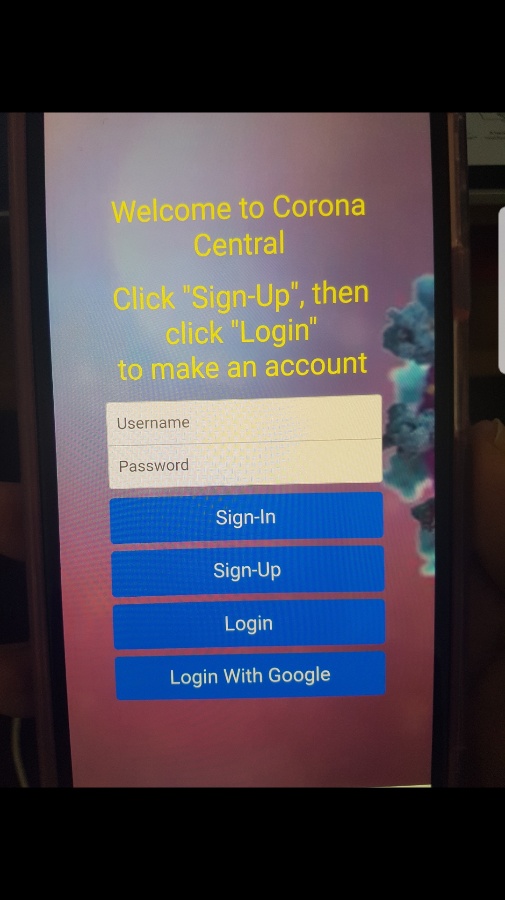
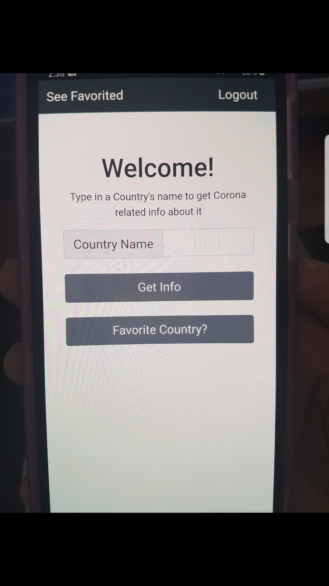

# Mobile-Apps-Final-Project
My Final Project for Mobile Apps where I create a Cordova Hybrid app about the coronavirus outbreak. 

This app will bring you to a login screen, this is the index.html file. Here you a few actions to choose from.
The "Sign-In" button uses a hardcoded username/password so if the input fields don't match an alert will pop up.
The hardcoded username/password is "user" and "password" respectively.
The "Sign-Up" button will save the username/password that the user provided when pressed and when the "Login" button is
pressed and the input fields match the saved username/password, it'll bring you to the next screen.
If the input fields are empty and "Sign-Up" is pressed and alert will pop up.
Note that the saved username/passwords temporarily stored once you leave the page they are gone.
The "Login With Google" button will log your devices to a google account of your chooseing.

After the login screen you will be taken to the home screen, this is the home.html file.
Here you can type in a county name of your choosing and press the "Get Info" button to get the overall stats related to Corona
such as # of cases, deaths, etc. The lasted stats are also displayed, both stats are orgainized in a graph.
Users can favorite a country by pressing the "Favorite Country?" button, which will the country name in the input field.
After that if the user presses the "See Favorited" button the input field will be overwritten to show the favorited country.
Note that one country could be favorited at a time so when pressing "Favorite Country?" again it'll overwrite the previously favorited country with whatever is in the input field. Like before with the login screen once you leave the home screen the favorited country will 
be gone. To go back to the login screen press the "Logout" button.

Sources I used to create this project:

I got the api from this.
https://documenter.getpostman.com/view/8854915/SzS7R6uu?version=latest

I used bootstrap templates.
https://getbootstrap.com/docs/4.4/examples/

index.html and sigin.html are based off of this template.
https://getbootstrap.com/docs/4.4/examples/sign-in/

home.html and favorites.html are based off of this template.
https://getbootstrap.com/docs/4.4/examples/starter-template/

The JavaScript for the Google Login came from this.
https://github.com/Telerik-Verified-Plugins/Google-Sign-In

The JavaScript for the graphs came from this.
https://canvasjs.com/html5-javascript-column-chart/

I got the image in the login screen from this site. 
https://www.aljazeera.com/news/2020/04/sunlight-humidity-kill-coronavirus-fastest-scientists-200424065853466.html

The codes can be found by following this path.
finalprojectworshop/www

Note that the sigup.html and the favorites.html are not utilized, there here because I orgininally wnated to use them, but I didn't how to properly intergrate them.

All other files are used.

Inorder to use this project your device needs to be able to use cordova commands see this to get started on that
http://ccoenraets.github.io/cordova-tutorial/index.html

Download the finalprojectworshop folder and run it on either an emulator or real device. Note that this project only works with Android.
If that doesn't work for whatever reason created a workshop and make sure it has the following plugins:

cordova-plugin-console

cordova-plugin-device

cordova-plugin-dialogs

cordova-plugin-googleplus

cordova-plugin-whitelist

Also make sure the plaforms is android.
After creating the workshop replace the conents in the www folder with that of finalprojectworshop.
